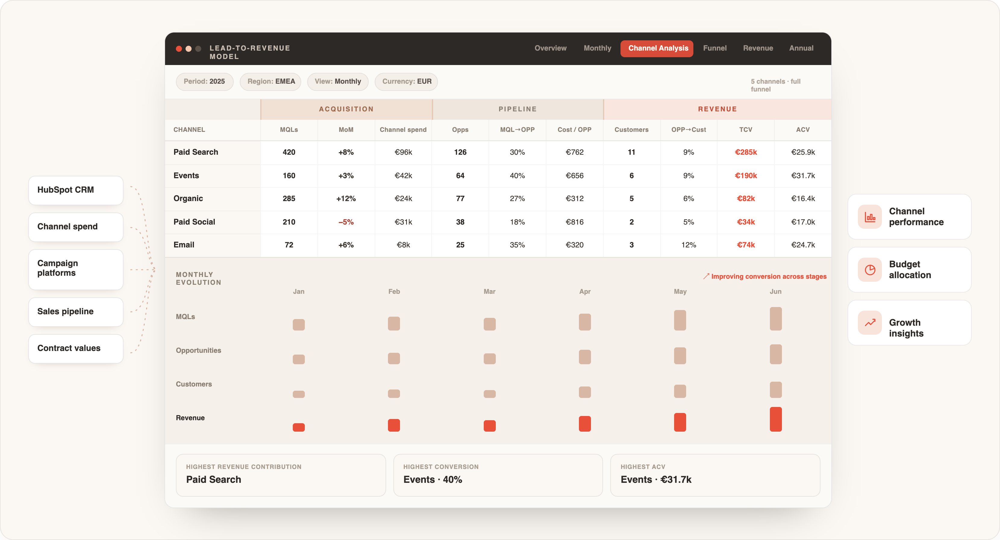
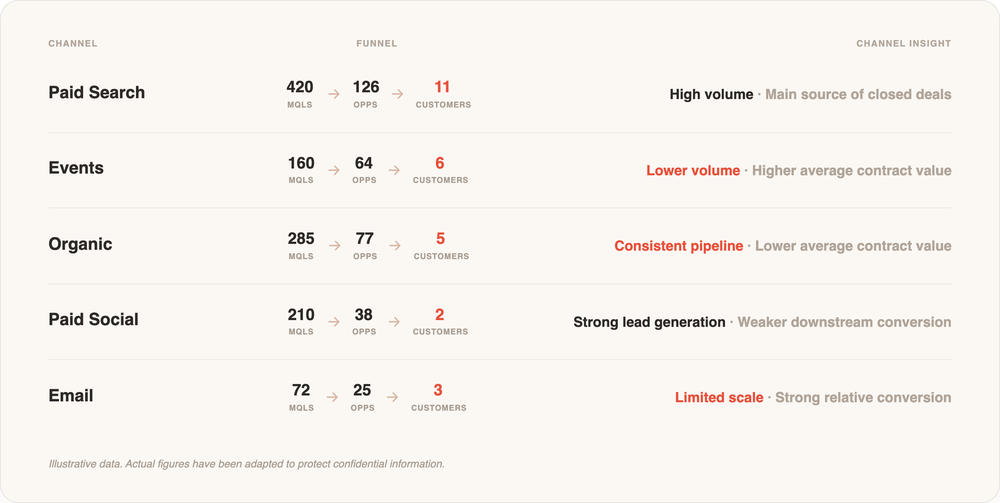

## De medir canales a entender qué estaba impulsando el revenue

En Blip ya teníamos muchos datos en HubSpot: leads, oportunidades, clientes y evolución del funnel.

Lo que faltaba era una forma clara de conectar esos resultados con la inversión de cada canal y compararlos de manera consistente mes a mes.

Porque saber cuántos leads había generado SEM, un evento o una campaña de paid social era útil, pero no suficiente.

Necesitábamos entender qué ocurría después: cómo convertía cada canal de lead a oportunidad y de oportunidad a cliente, qué valor terminaba generando y cómo cambiaba su eficiencia al aumentar o reducir la inversión.

Para responder a esas preguntas, construí un sistema de reporting en Excel que combinaba los datos de HubSpot con la inversión mensual de cada canal.

**Cómo lo construí**

Organicé el rendimiento de SEM, eventos, orgánico, paid social, email marketing y otras iniciativas bajo una misma estructura.

Para cada canal podíamos ver leads cualificados, oportunidades, clientes, conversión entre etapas, inversión, coste por resultado, valor de los contratos y evolución mensual y trimestral.

La idea no era sustituir los dashboards de HubSpot, sino añadir una capa de análisis que permitiera interpretar mejor el rendimiento de cada fuente de adquisición.

Así podíamos ver si un canal generaba mucho volumen, pero convertía peor en oportunidades; si otro aportaba menos leads, pero contratos de mayor valor; o si una subida de inversión estaba generando crecimiento real o simplemente más actividad en la parte alta del funnel.

**Un sistema que ganaba valor cada mes**

Cada mes extraía y validaba los nuevos datos de HubSpot, actualizaba la inversión por canal y comparaba los resultados con los periodos anteriores.

Mantener la misma estructura nos permitía detectar rápidamente cambios en las conversiones y saber dónde mirar cuando algo se desviaba.

Por ejemplo, podíamos identificar si un canal mantenía el volumen de leads, pero empezaba a convertir peor en oportunidades; si aumentaba el coste por oportunidad; o si una caída en clientes se explicaba por menor captación o por un problema en una etapa posterior del funnel.

El modelo funcionaba también como un sistema de alerta: en lugar de detectar simplemente que un canal "iba peor", podíamos ver qué había cambiado, en qué etapa y desde cuándo.

Además, en un negocio B2B, un lead podía tardar varios meses en convertirse en oportunidad o cliente. Tener el histórico ayudaba a no evaluar los canales únicamente por resultados inmediatos y a separar mejor tres variables que muchas veces se mezclan: **volumen, calidad y valor**.

**De reporting a decisiones de crecimiento**

El modelo se convirtió en una referencia común para Marketing, Ventas y Dirección.

Permitía comparar canales bajo los mismos criterios, detectar dónde se estaba perdiendo conversión y relacionar los cambios de rendimiento con la inversión, la estacionalidad o las campañas activas.

Esto daba más contexto a las decisiones de presupuesto.

No se trataba simplemente de invertir más en el canal que generaba más leads, sino de entender qué función cumplía cada fuente dentro del funnel y qué estaba aportando realmente al pipeline y al revenue.

**Del seguimiento mensual a la visión anual**

Al mantener la misma estructura durante todo el año, pude utilizar el histórico para construir el informe anual de rendimiento de Marketing en EMEA.

Esto permitió analizar cómo evolucionaban las conversiones, el valor de los contratos y el papel de cada canal a lo largo del tiempo, en lugar de limitar el análisis a resultados aislados de cada mes.

Más que presentar cifras finales, el sistema ayudaba a explicar qué estaba cambiando dentro del funnel, qué podía estar detrás de esa evolución y dónde tenía sentido actuar.

**Resultado**

El resultado fue una visión consistente del rendimiento de marketing desde la inversión inicial hasta el pipeline y el revenue generado.

El modelo nos permitió entender cómo funcionaban nuestras fuentes de adquisición y qué papel cumplía cada una dentro de la estrategia: cuáles aportaban volumen, cuáles convertían mejor y cuáles generaban oportunidades de mayor valor.

En lugar de mirar únicamente qué canal producía más leads, podíamos responder una pregunta mucho más útil para el negocio:

**¿Qué canal funciona mejor para qué, qué está cambiando en su rendimiento y dónde tiene más sentido seguir invirtiendo?**

*Nota: Los datos mostrados son ilustrativos y han sido modificados para proteger información confidencial. La estructura del análisis y las conclusiones reflejan el trabajo realizado.*
